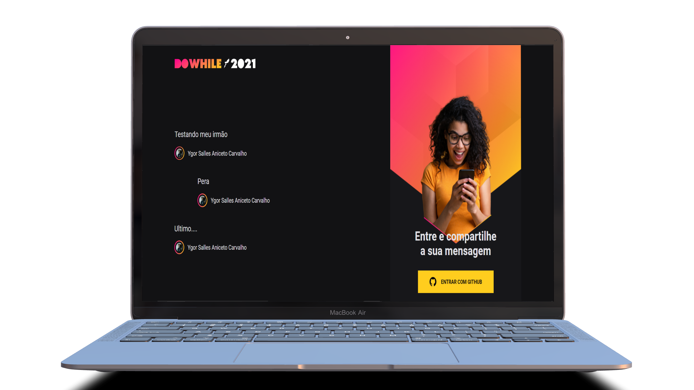

# nlw-heat-react

<h4 align="center">
    :computer: App NLW-HEAT - Aplicação para registro de comentários sobre o DOWHILE
</h4>

    <a href="#-projeto">Projeto</a>&nbsp;&nbsp;&nbsp;|&nbsp;&nbsp;&nbsp;
    <a href="#rocket-tecnologias">Tecnologias</a>&nbsp;&nbsp;&nbsp;|&nbsp;&nbsp;&nbsp;
    <a href="#user-content-clipboard-instruções">Instruções</a>&nbsp;&nbsp;&nbsp;|&nbsp;&nbsp;&nbsp;
    <a href="#-ajustes-e-melhorias">Melhorias</a>

 

## 💻 Projeto

Frontend App em ReactJS. App frontend para Aplicação para registro de comentários com autenticação do github.
Aplicação implementada no evento nlwheat 2021 da Rockeseat.

 

## :rocket: Tecnologias

- [ReactJS](https://pt-br.reactjs.org/)
- [Vite](https://vitejs.dev/)
- [Typescript](https://www.typescriptlang.org/)
- [HTML5](https://developer.mozilla.org/pt-BR/docs/Web/Guide/HTML/HTML5)
- [CSS3](https://developer.mozilla.org/pt-BR/docs/Web/CSS)
- [Axios](https://axios-http.com/)
- [Socket.io](https://socket.io/)

---

## :clipboard: Instruções

### INTERFACE - FRONTEND

- Execute `$ yarn` para instalar todas as dependencias.
- Crie um arquivo `.env` e preencha as informações de cada variável de ambiente, as variáveis para serem preenchidas se encontram no arquivo `env.example`.
- Após todas as dependencias serem instaladas e as variáveis serem preenchidas, basta executar `yarn dev` para iniciar a interface frontend.

---

## 📌 Ajustes e melhorias

Até o momento nenhuma nova feature de melhoria do projeto.

